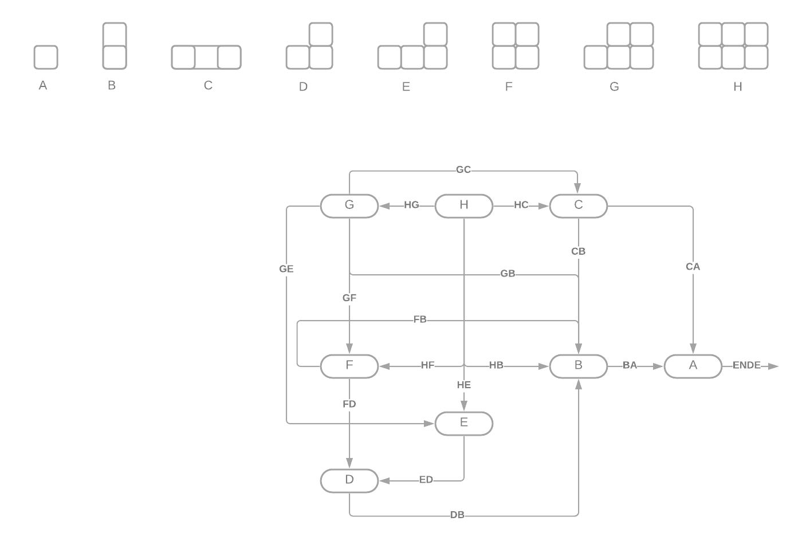

# Übungsblatt 01

|Gruppennummer|Übungsleiterin|Name|
|---|---|---|
|09|Emma Stellwag|Roman Gräf|
|04|Rebeca Gehlhaar|Kai Dominik Westphal|
|03|Sebastian Fritz|Michael Gouchtchine|

## Aufgabe H1.1

### a)

### b)

Die Position A ist eine Verlier-Position. Durch das Essen des letzten Stückes verliert man und es führt kein Weg daran vorbei. Eine Gewinnposition wäre eine, die den Gegner in Position A bringen kann, z.B B oder C. Dadurch ist auch D eine Verlier-Position da es in der Position keinen anderen Optionen gibt als den Gegner in eine Gewinnposition zu bringen.
Durch E und F kann man den Gegner in Position D zwingen. Somit sind diese Gewinnpositionen.
Position G erlaubt es lediglich den Gegner in Gewinnpositionen bringen zu können, daher ist G eine Verlier- Position.

### c)

Derjenige der anfängt kann immer gewinnen indem er/sie zu Beginn (H) das Stück oben links isst und den Gegner damit in die Verlier-Position G bringt. Der Gegner muss wählen zwischen B,C,E oder F; Er befindet sich stets in einer Verlier-Position, während der/die beginnende Spieler/in sich immer in einer Gewinnposition befindet.

## Aufgabe H1.2

### Aufgabe a)

 - (i) Die Relation $R_1$ ist nicht reflexiv. Beispiel: $\lbrace a\rbrace$
 - (ii) Die Relation $R_2$ ist reflexiv, symmetrisch und transitiv $\implies$ eine Äquivalenzrelation.
 - (iii) Die Relation $R_3$ ist reflexiv, symmetrisch und transitiv $\implies$ eine Äquivalenzrelation.

### Aufgabe b)

 - (ii) Die Relation $R_2$ ist verträglich mit der Konkatenationsoperation.
 - (iii) Die Relation $R_3$ ist nicht verträglich mit der Konkatenationsoperation.

Gegenbeispiel:

$u_1 = ababa$
$v_1 = babab$
$u_2 = abba$
$v_2 = abba$

$$(u_1,v_1)\in R_3\text{ und }(u_2,v_2) \in R_3\text{ aber }(u_1u_2, v_1v_2) \notin R_3$$

## Aufgabe H1.3

$$T(n)=\frac{n\cdot(n+1)}{2}$$
$$f(x,y)=T(x+y)+x=T(m)+x$$

Für ein gegebenes $n\in\mathbb{N}$ wähle man das größtmöglichste $m\in\mathbb{N}$ so, dass $T(m)\le n$ gilt, sowie $x=n-T(m)$. Da $T(m)\le n<T(m+1)$: $x=n-T(m)<T(m+1)-T(y)=m+1$, d.h. das $y=m-x>0$. Dementsprechend existiert für jedes $n$ mindestens ein Paar $(x,y)$ für das $f(x,y)=n$ gilt.

Angenommen es existeren $(x,y),(i,j)\in\mathbb{N}\times\mathbb{N}$, so dass $T(x)+y=T(i)+j$, mit $x\le y\land i\le j$ und $x\le i$. $T(n)$ kann als $\sum_{m=1}^{n}m$ neuschreiben (siehe Gaussche Summenformel).
$$y+\sum_{n=1}^{x}n=\sum_{n=1}^{i}n+j$$
$$y-j=\sum_{n=x+1}^{i}n$$

Falls $x<i$, dann muss $y-j=0$ sein $\implies y=j\implies T(x) = T(i)\implies i=x$.
Ansonsten $x=i\implies y=j$.

Dementsprechend ist es eindeutig.

Da sowohl injektivität als auch surjektivität bewiesen sind, ist die bijektivität bewiesen.

### Funktion g

Die Funktion $f$ erhält ein 2-Tupel natürlicher Zahlen $x$ und $y$ und bringt sie zu einem Wert $w\in\mathbb{N}$.                     
<!--Wir nehmen an, dass $f$ bijektiv ist, auch wenn wir es nicht vollständig beweisen können.-->
Für die Eingabe $f(w,z)$ mit $z\in \mathbb{N}$ erhalten wir also ebenfalls ein singuläres Ergebnis.
Bringen wir nun $w$ in seine Ursprungsform $f(x,y)$ so erhalten wir $f(f(x,y),z)$, welches auch bijektiv ist.
Damit verknüpft es 3 Elemente aus $\mathbb{N}$, man könnte es also auch schreiben als Funktion $g(x,y,z)$, welche eine Bijektion von $\mathbb{N}\times\mathbb{N}\times\mathbb{N} \longmapsto \mathbb{N}$ darstellt.    
$g(x,y,z)=\frac{(f(x,y)+z)\cdot(f(x,y)+z+1)}{2}+f(x,y)$                    
