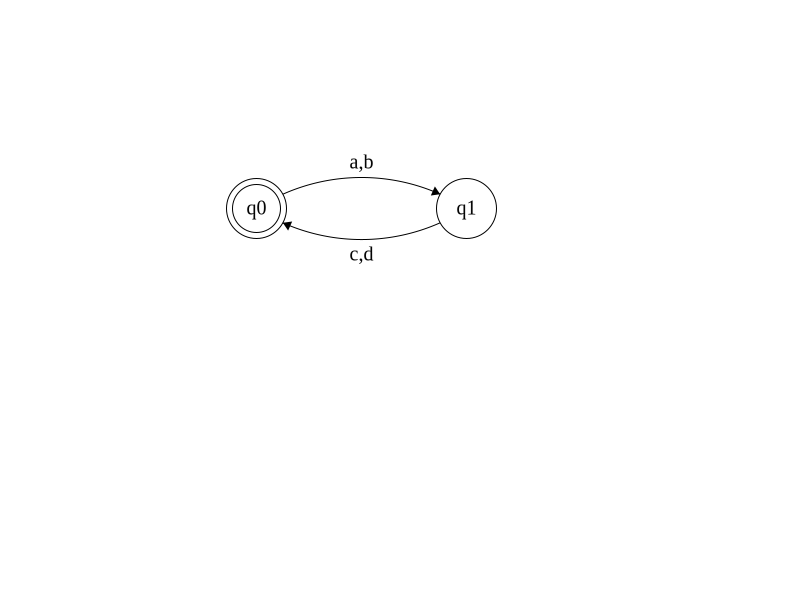
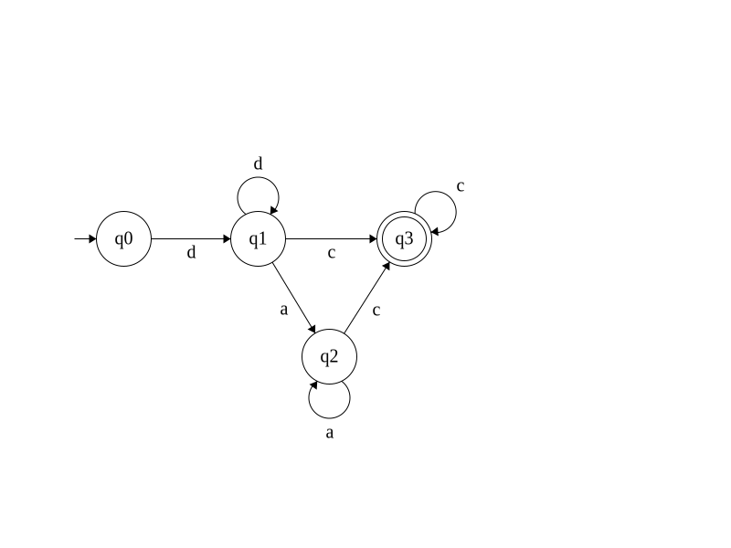

# Übungsnummer 2

|Gruppennummer|Übungsleiterin|Name|
|---|---|---|
|09|Emma Stellwag|Roman Gräf|
|04|Rebekka Gehlhaar|Kai Dominik Westphal|
|03|Sebastian Fritz|Michael Gouchtchine|

## H2.1
### a)
 - (i)

Induktionsanfang

$2^3=8>6=2\cdot3$

Induktionsvorraussetzung:

$2^n>2n$

Induktionsschluss:

$2^n>2n\implies 2^n\cdot 2>2n\cdot 2\implies 2^{n+1}=2(n+1)$

 - (ii) $n=0,5\implies n^2+n+41=46,125$ Bei 46,125 handelt es sich nicht um eine Primzahl.

### b)

$f(a_0a_1b)=f(a_1b)+1=f(b)+2=f(a_0b)+1=f(a_1a_0b)$. Dank $f$s rekursiver Definition folgt aus diesem Umstand dass beliebige Elemente getauscht werden können ohne dass sich der $f$ wert ändert. Da ein Wort mit $n$ Elementen mit endlich vielen Tauschungen zu einer beliebigen Permutation desselben Wortes umgeformt werden kann, gilt $f(a\cdot b)=f(b\cdot a)$.

Induktionsanfang

$f(\epsilon\cdot\epsilon)=1=f(\epsilon)+f(\epsilon)-1$

Induktionsvorraussetzung:

$f(v\cdot w)=f(v)+f(w)-1$

Induktionsschluss:

$$f(v\cdot w)=f(v)+f(w)-1$$
$$f(v\cdot w)+1=f(v)+1+f(w)-1$$
$$f(av\cdot w)=f(av)+f(w)-1$$

## H2.2
### a)

 - (i) Laut Definition der Sternoperation aus dem Folien: $L=L^1\subseteq \bigcup_{m=0}^\infty L^m=L^*$.

 - (ii) $( \forall w \in M^* : w^* \in M^* \land \forall c \in L : c^* \in M^* ) \implies \forall d \in L^* : d^* \in M^* \implies L^* \subseteq M^*$

### b)

 - (i) $(L^*)^* = \bigcup_{n=0}^\infty (\bigcup_{m=0}^\infty L^m)^n=\bigcup_{n=0}^\infty \bigcup_{m=0}^\infty L^{m\cdot n}=\bigcup_{n=0}^\infty L^n=L^*$

 - (ii) $L\subseteq M\implies L\subseteq M\subseteq M^* \implies L\subseteq M^* \implies L^* \subseteq M^*$

### c)

Erstens: $(L\cup M \subseteq L^* M^* )\land (A\subseteq B\implies A^* \subseteq B^* \text{siehe b.2})\implies (L\cup M)^* \subseteq (L^* M^* )^*$

Zweitens:
$(L\cup M)^*=\{\epsilon\}\cup\{w_1\cdot ... \cdot w_n:n>1,w_i\in L\lor w_i\in M, für i=1,...n\}$

Drittens: Hierbei ist $x_i$ Schreibweise für die i-te Komponente von x.

$\forall x\in (L^* M^* )^* : x_i\in L\lor x_i\in M$

Dementsprechend gilt $(L^* M^* )^* \subseteq (L\cup M)^*$. Aus Erstens und Drittens lässt sich schließen dass $(L^* M^* )^* = (L\cup M)^*$

## H2.3

