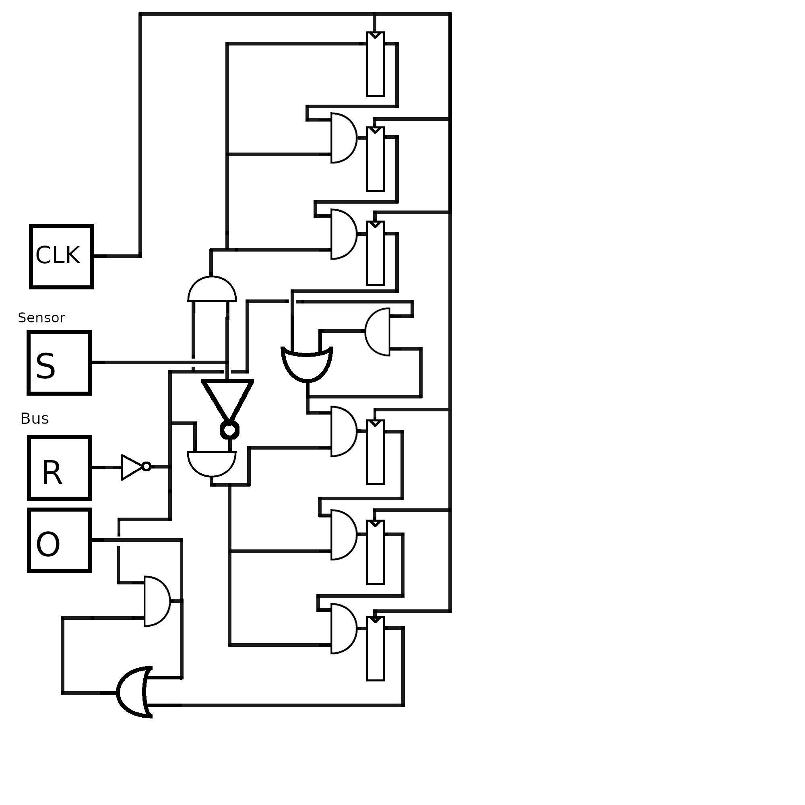
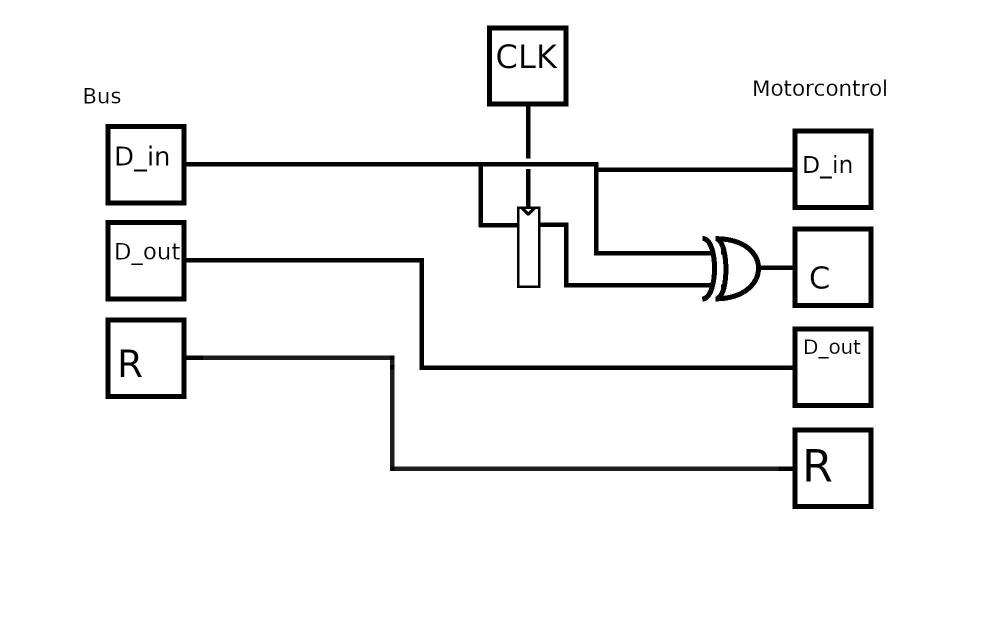
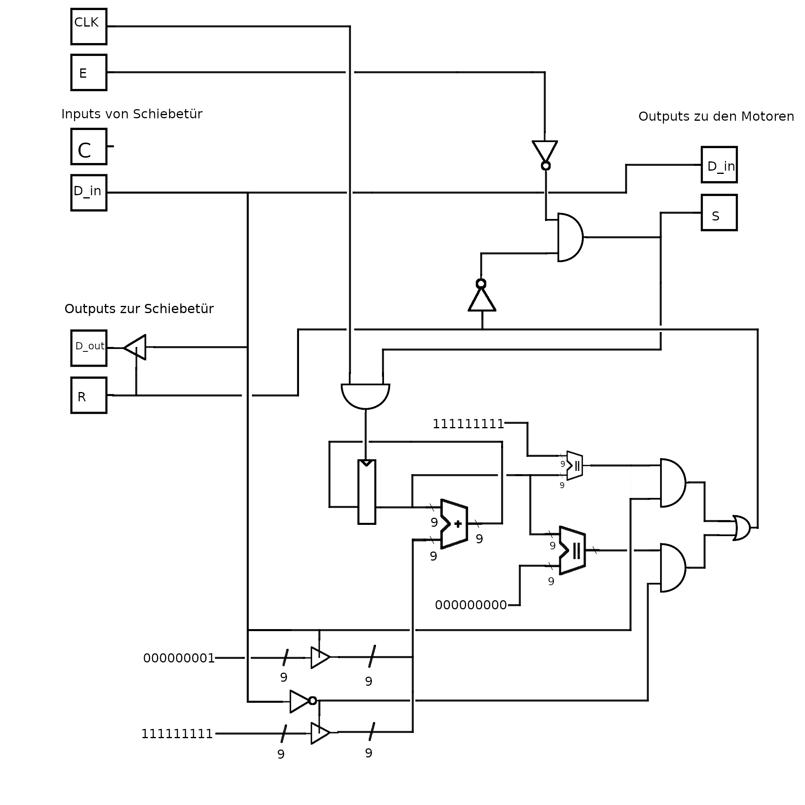
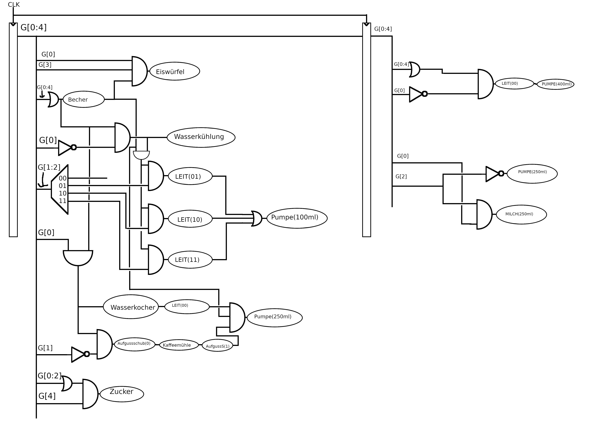
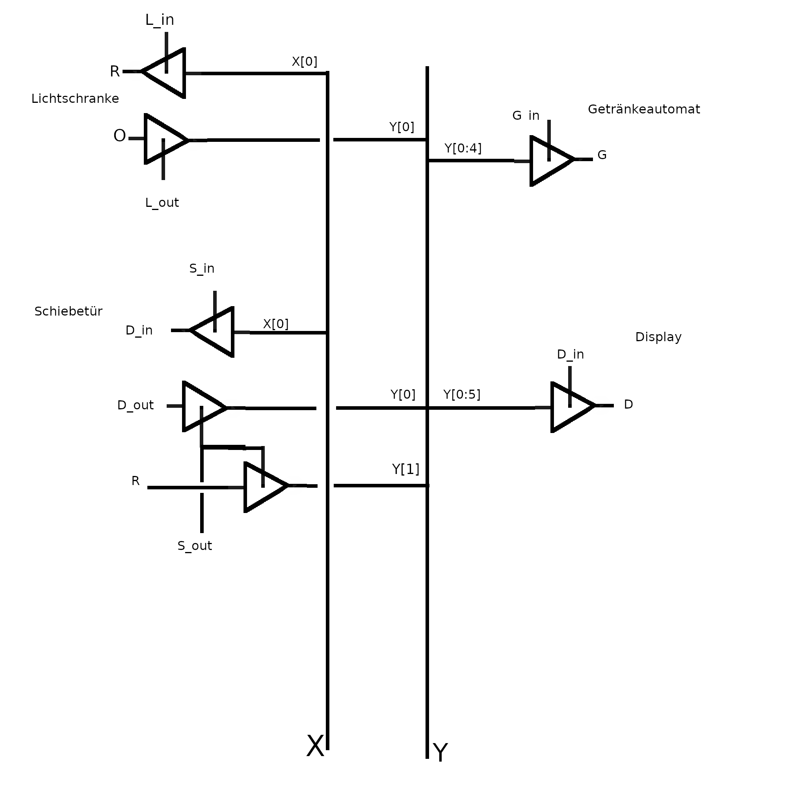

# Digital Technik Projekt Teil 2

Roman Gräf

## 2.1a)


Der Schaltkreis besteht aus dem Input aus zwei Dreierketten von D-Flip-Flops, eine um Drei An-Takte zu überprüfen, und eine um Drei-Aus-Takte zu überprüfen.

Die Dreierketten haben als Input in die D-Flip-Flops immer den Output des vorherigen D-Flip-Flops, geodert mit dem invertierten Reset-Signal und entweder dem Sensor-Input, oder dem invertierten Sensor-Input, für die An/Aus-Kette jeweils. Zusätzlich ist nach den beiden Ketten eine Schaltung um ein Output bis zum nächsten Reset zu erinnern. Der Output der letzten Kette wird an den Bus geschickt.

## 2.1b)



Dieser Schaltkreis kann fast alle Inputs einfach entweder an Motorcontrol weiterleiten, oder an den Bus zurückleiten. Die Ausnahme bildet C, welches bei einer Änderung des D_in(bus) Signals für einen Takt 1 wird. Dementsprechend ist C das XOR von D_in und dem D_in des letzten Takts (durch ein D-Flip-Flop verzögert)

## 2.1c)



C ist in dieser Schaltung ungenutzt. Theoretisch könnte C in Verbindung mit dem Signal das in R führt in eine S-R-Latch geführt werden die den Motor an oder Ausschaltet. Das erweist sich allerdings als nicht notwendig, da der Motor sowieso nur läuft wenn er nicht am Ziel ist (welches sich bei einer Änderung von D_in sowieso ändert). Da jedes Signal von C auch eine Änderung an D_in bedeutet, heißt dass das C hier ignoriert werden kann.

Die Schaltung besteht im Wesentlichen aus einer 9-bit D-Flip-Flop Speicherzelle, die solange der Motor läuft entweder 0x1 oder 0x1ff addiert, abhängig von D_in. Hierbei wird der Overflow von Binärzahlen ausgenutzt, wodurch eine Addierung von 0x1ff zu einer Subtraktion von 0x1 führt.

Der aktuelle Zustand der Speicherzelle wird mit entweder 0x0 oder 0x1ff verglichen. Abhängig von der Fahrrichtung (D_in) wird das eine oder das andere Ergebnis gewählt. Das Ergebnis dieser Kalkulation ist ein Wahrheitswert der beschreibt ob wir am Endzustand in diese Richtung sind. Falls dem der Fall ist, wird R gesetzt und der Motor gestoppt. Das Signal an den Motor wird zusätzlich noch mit dem invertiertem Emergency-Input geundet, so dass der Emergency-Knopf die Motoren ausschaltet und die Addierungen anhält.

Die Outputs zu den Motoren sind für beide Motoren gleich, dementsprechend habe ich sie hier zusammengefasst.


### 2.2a)

 - Wasser: 000X1
    - X = Eiswürfel
 - Cola: 001XY
    - X = Eiswürfel
    - Y = Zucker
 - Orange: 010XY
    - X = Eiswürfel
    - Y = Zucker
 - Zitrone: 011XY
    - X = Eiswürfel
    - Y = Zucker
 - Kaffee: 1000Y
    - Y = Zucker
 - Milchkaffee: 101XY
    - X = LatteMachiato: 0 oder Cappuccino: 1
    - Y = Zucker
 - Tee: 1100Y
    - Y = Zucker

|Getränk|Code|
|----|----|
|Wasser|00001|
|Wasser m. Eiswürfeln|00011|
|Cola|00101|
|Cola o. Zucker|00100|
|Cola m. Eiswürfeln|00111|
|Cola m. Eiswürfeln o. Zucker|00110|
|Orange|01001|
|Orange o. Zucker|01000|
|Orange m. Eiswürfeln|01011|
|Orange m. Eiswürfeln o. Zucker|01010|
|Zitrone|01101|
|Zitrone o. Zucker|01100|
|Zitrone m. Eiswürfeln|01111|
|Zitrone m. Eiswürfeln o. Zucker|01110|
|Kaffee|10000|
|Kaffee m. Zucker|10001|
|LatteMachiato|10100|
|LatteMachiato m. Zucker|10101|
|Cappuccino|10110|
|Cappuccino m. Zucker|10111|
|Tee|11000|
|Tee m. Zucker|11001|

Diese Kombinationen sind noch nicht besetzt: 11011 11010 10010 10011 11100 11111 11101 11110 00011 00001

Wenn man dem logischem Aufbau der anderen Getränke folgt kann man einen Teil als Wasser (mit oder ohne Eiswürfel) mit Zucker sehen (00001 und 00011). Der Rest wären jeweils zwei Varianten von Tee und Kaffee (jeweils für gezuckert und ungezuckert), sowie ein komplett neues Heisgetränk welches auch zwei mal zwei Varianten hätte.

## 2.2b  




Der Takt für diese Zweistufenpipeline muss 1/9 Hz sein, da die Wasserkühlung 9s braucht um das Wasser zu kühlen.


## 2.3

Syntax für das hier:
```
STATE name outputname=outputvalue outputname2=outputvalue
TRANSITION vonname, inputname=inputvalue & inputname2=inputvalue2 -> zuname
n TIMES -> i:
```
STATE erzeugt einen state, TRANSITION gibt eine transition an. n TIMES wiederholt den block n mal mit der variable i gesetzt.


```
STATE shutdown
INITIAL_STATE 50_wait
50 TIMES -> i:
  STATE $i_wait
  32 TIMES -> g:
    STATE $i_drink_$g G_in=1 Y(G)=$g
    TRANSITION $i_wait, V & $g -> $i_drink_
    TRANSITION $i_drink_ -> $i_door_opening
  STATE $i_door_opening S_in=1 S_out=1 Y(D_in)=1
  TRANSITION $i_door_opening, X(R)=1 -> $i_door_open
  TRANSITION $i_door_opening, X(D_in)=0 -> shutdown
  STATE $i_door_open L_out=1
  TRANSITION $i_door_open, X(O) -> $i_person_passed
  STATE $i_person_passed L_in=1 Y(R)=1
  TRANSITION $i_person_passed -> $i_door_closing
  STATE $i_door_closing S_in=1 S_out=1 Y(D_in)=0
  TRANSITION $i_door_closing, X(D_in)=1 -> shutdown
  TRANSITION $i_door_closing, X(R)1 -> $i_door_closed
  STATE $i_door_closed D_in=1, X(D)=$i
  IF $i == 1:
    TRANSITION $i_door_closed -> shutdown
  ELSE:
    TRANSITION $i_door_closed -> $(i-1)_wait
```
Ich hoffe hier war kein Diagram gefordert, mir war allerdings nicht klar wie ich das mit so vielen Zuständen sinnvoll zeichnen soll.


## 2.4


