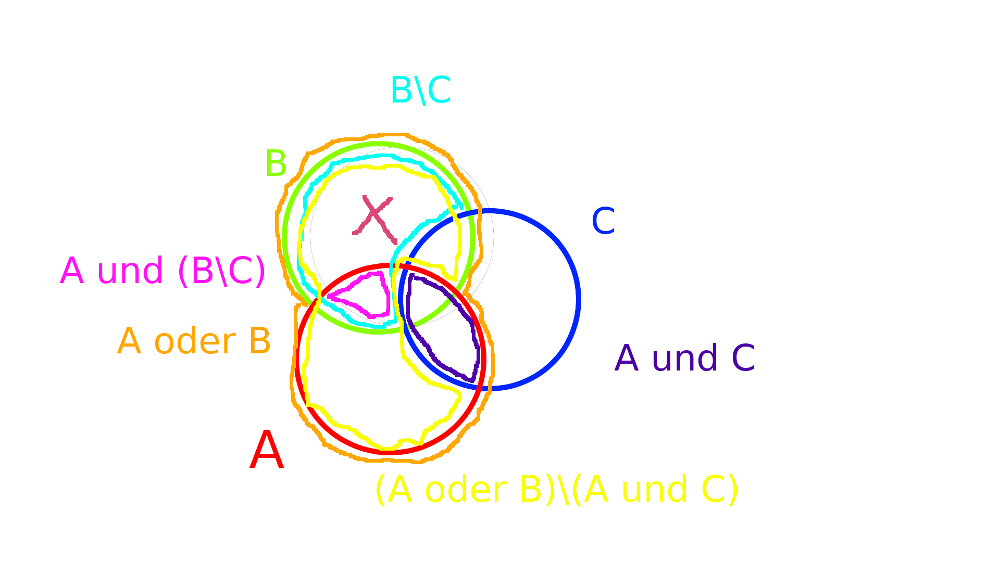

|Gruppennumer|Übungsleiterin|Übungsnummer|Name|
|---|---|---|---|
|10|Eya Chemangui|01|Roman Gräf|

      

# Hausübungen
Bitte H1.1 und H1.2 bewerten.

## Aufgabe H1.1
### a)

 - "Es gibt eine kleinste natürliche Zahl" ist eine wahre Aussage.
 - $\exists x \in \mathbb{Q} | x^2 = 2$ ist eine falsche Aussage.
 - "Die Zahl 99 ist kleiner." ist keine Aussage.
 - "Es gibt Leben auf anderen Planeten." ist eine Aussage. Der Wahrheitswert ist für mich leider nicht möglich zu bestimmen.
 - "Zu Hilfe, zu Hilfe!" ist keine Aussage.
 - $\exists y\in \mathbb{N} | x + y \leq 3$ ist eine Aussage. Der Wahrheitswert lässt sich ohne die Variable x leider nicht bestimmen. Falls $x$ aus der Aussage (ii) gemeint ist, so handelt es sich um eine wahre Aussage.

### b)

 - Die Menge der ganzen Zahlen besitzt ein größtes Element

$\exists x \in \mathbb{Z} | \forall y \in \mathbb{Z} | y \leq x$

Negation: Die Menge der ganzen Zahlen besitzt kein größtes Element
$\neg (x \in \mathbb{Z} | \forall y \in \mathbb{Z} | y \leq x) \iff \forall x \in \mathbb{Z} | \exists y \in \mathbb{Z} | x \leq y$

 -  Jede natürliche Zahl ist gleich Null oder von der Form $n+1$ mit $n\in\mathbb{N}$

$\forall x \in \mathbb{N} | [(x = 0) \lor(\exists n \in \mathbb{N}|x = n + 1)]$

## Aufgabe H1.2

### a)

 - $K\cap L = [4,7]$
 - $K\backslash L = (2,4)$
 - $K\times L = \lbrace(x,y)\in \mathbb{R}\times\mathbb{R}|(2<x\le 7)\land(4\le y < 9)\rbrace$

### b) $A = \lbrace\lbrace 1\rbrace,2\rbrace$

 - $\lbrace\lbrace 1\rbrace\rbrace \in \wp(A)$ - wahr
 - $\lbrace\lbrace 1\rbrace\rbrace \subseteq \wp(A)$ - falsch
 - $\lbrace\lbrace 2\rbrace\rbrace \in \wp(A)$ - falsch
 - $\lbrace\lbrace 2\rbrace\rbrace \subseteq \wp(A)$ - wahr
 - $\lbrace\lbrace 1\rbrace,2\rbrace \in \wp(A)$ - wahr
 - $\lbrace\lbrace 1\rbrace,2\rbrace \subseteq \wp(A)$ - falsch

## Aufgabe H1.3

### a)

 - $R_1$ ist reflexiv, transitiv und symmetrisch, aber nicht antisymmetrisch. Es handelt sich weder im eine Äquivalenzrelation.
 - $R_2$ ist antisymmetrisch und transitiv, aber nicht reflexiv oder symmetrisch. Es handelt sich weder im eine Äquivalenzrelation, noch um eine Ordnungsrelation.
 - $R_3$ ist antisymmetrisch, reflexiv und transitiv, aber nicht symmetrisch. Es handelt sich um eine Ordnungsrelation.

### b)

Die Relation $R$ genau dann eine Totalordnung auf einer Menge $X$ ist, wenn sie für jede zwei Elemente von $X$ mindestens einen Eintrag (x,y) oder (y,x) enthält. Da $R$ der Durchschnitt von $R_1$ und $R_2$ ist, müssen sowohl $R_1$ als auch $R_2$ alle für jedes $x\in X,y\in X$ genau entweder $(x,y)$ oder $(y,x)$ enthalten.

# Gruppenübungen

## Aufgabe G1.1

### a)
$\neg(A\land B)\iff (\neg A) \lor (\neg B)$

|$A$|$B$|$\neg(A\land B)$|$(\neg A) \lor (\neg B)$
|---|---|---|---|
| 0 | 0 | 1 | 1 |
| 0 | 1 | 1 | 1 |
| 1 | 0 | 1 | 1 |
| 1 | 1 | 0 | 0 |
Wahrheitstabellen stimmen überein.

$\neg(A\lor B)\iff (\neg A) \land (\neg B)$

|$A$|$B$|$\neg(A\lor B)$ | $(\neg A) \land (\neg B)$|
|---|---|---|---|
| 0 | 0 | 1 | 1 |
| 0 | 1 | 0 | 0 |
| 1 | 0 | 0 | 0 |
| 1 | 1 | 0 | 0 |
Wahrheitstabellen stimmen überein.

### b)
$[A\implies B]\iff [(\neg B)\implies(\neg A)]$

|$A$|$B$ | $A \implies B$ | $(\neg B)\implies(\neg A)$ |
|---|---|---|---|
| 0 | 0 | 1 | 1 |
| 0 | 1 | 1 | 1 |
| 1 | 0 | 0 | 0 |
| 1 | 1 | 1 | 1 |
Wahrheitstabellen stimmen überein.

### c)

|$A$|$B$|$A \implies B$|$B\implies A$|
|---|---|---|---|
| 0 | 0 | 1 | 1 |
| 0 | 1 | 1 | 0 |
| 1 | 0 | 0 | 1 |
| 1 | 1 | 1 | 1 |
Wahrheitstabellen stimmen nicht überein.

## Aufgabe G1.2

### a) $\forall x \in W  | F(x)$
Alle Wände die ein Fenster haben.

Negiert:
$\exists x \in W | \neg F(x)$

Es gibt eine Wand die kein Fenster hat.

### b) $\forall x \in W | (T(X)\implies(\neg F(X)))$
Alle Wände die Türen haben, haben keine Fenster.

Negiert:
$\exists x \in W | (T(X)\land  F(X))$
Es gibt eine Wand die sowohl Tür als auch Fenster hat.

## Aufgabe G1.3

Das pinke Kreuz ist in $(A\cup B)\backslash(A\cap C)$, aber nicht in $A \cap(B\backslash C)$

## Aufgabe G1.4

### a)
$$M = \mathbb{N} \\
R = \lbrace(n,m) \in M \times M | n = m\rbrace$$

### b)
$$M = \lbrace0,1\rbrace \\
R = \lbrace(0,1)\rbrace$$

### c)
$$M = \lbrace0,1\rbrace \\
R = \lbrace(0,1),(1,0)\rbrace$$
